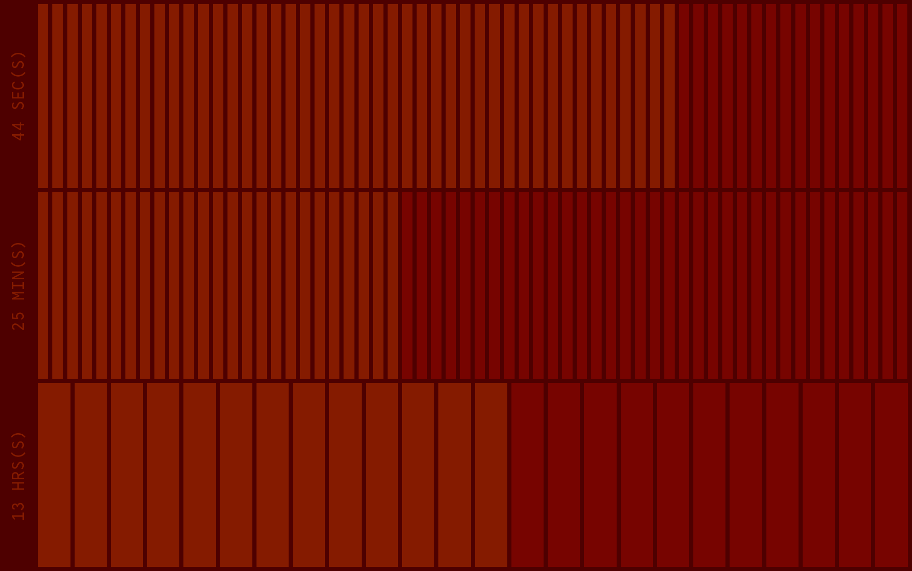

### Bar Clock ⌚

A project from **week 1** of the FAC 22 pre-apprenticeship. 

💾 See full pre-apprenticeship repository [here](https://github.com/cemalokten/fac-pre-apprenticeship). 

The bar clock is a way to tell the time visually by counting bars. 

Designed to act like a screensaver that tells the time.

Click the page to change from cool purple to warm red.

### 📚 What I learnt
- Retrieve current date and time with `new Date()` and `.getHours()` `.getMinutes()` `.getSeconds()`
- Repeat element with `.repeat()`
- Use `innerHTML` to maniuplate page
- That to short a `setInterval()` can slow a page down 🤭
- Updating `:root` styles with `setProperty()`
- Stacking CSS classes/id's
- Divide up page using CSS `grid` along with `flex`

### 🦺 Testing
- Works on latest version of Firefox, Chrome and Edge
- Mobile only works in landscape
- Further testing required

### ⏳ Future improvements
- [ ] Different time-zones
- [ ] More colours
- [ ] Refine look
- [ ] Information section about the project
- [ ] Mobile version

### 👀 Screenshots

